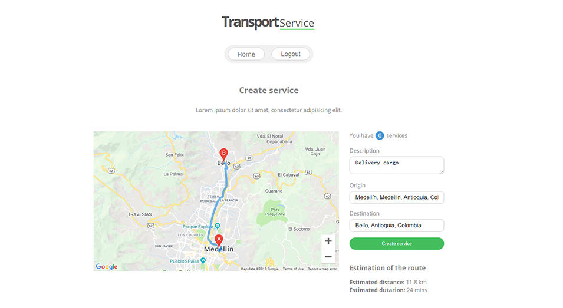

## Shipping Service

Shipping Service.



## Install

Create a file ```.env``` from the ```.env.example```
<br>
Add a valid API KEY for Google Maps Api Js in the file .env 
<br>
Follow this guide [Get APY key](https://developers.google.com/maps/documentation/javascript/get-api-key)

Install with [yarn](https://yarnpkg.com):

```sh
$ yarn install
```

## Run

```sh
$ yarn start
```
Visit `http://localhost:8080/`

## Google Maps API JS

Example service directions Google Maps
[Places autocomplete directions](https://developers.google.com/maps/documentation/javascript/examples/places-autocomplete-directions)

## Features

* React 16
* React Router
* Redux
* Webpack 4
* Babel
* Hot Module Replacement
* Google Maps
